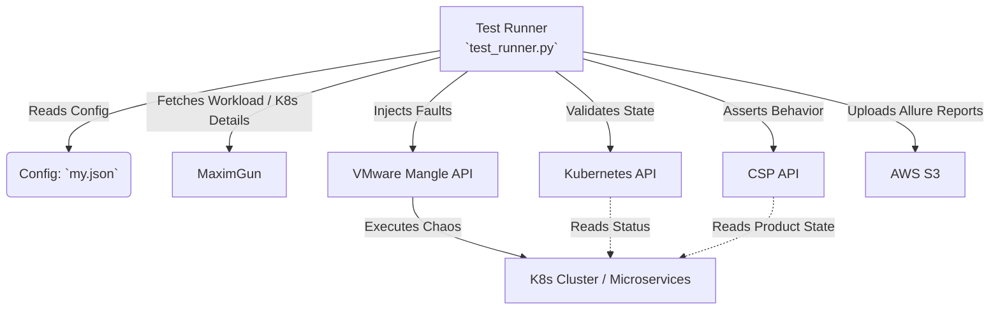

# MangleYaan

MangleYaan is a modular resiliency and chaos test framework developed to run fault injection and resiliency test cases for CSP microservices on Kubernetes. It acts as an orchestrator that leverages [VMware Mangle](https://github.com/vmware-archive/mangle) (an end-of-life fault injection tool) to inject faults into targeted environments and validates the system's resiliency via Kubernetes and CSP APIs.

## Architecture and Workflow

The framework operates by triggering tests via the command line (or CI/CD).
It uses a pre-configured configuration (`my.json`) to communicate with all underlying services. 
Additionally, it utilizes **MaximGun**, a workload manager, to fetch critical execution details such as which Kubernetes cluster the tests should run on, the schedule of triggers, and the kubeconfig needed to interact with the environment.

> **Note:** If you are using PyCharm, you can install the [Mermaid Visualizer Plugin](https://plugins.jetbrains.com/plugin/30432-mermaid-visualizer) to view the rendered architecture diagram directly in your IDE.



## Features
- **Automated Chaos Execution**: Uses Mangle APIs to programmatically schedule and inject infrastructure and application-level faults (e.g., CPU spikes, memory leaks, Pod kills).
- **Cluster State Validation**: Interacts with the Kubernetes API to verify if the resources recover successfully after the chaos experiment.
- **Detailed Reporting & Trend Generation**: Integrates with `pytest-html` and **Allure** to provide rich, trend-based test reports, which are automatically uploaded to AWS S3 upon completion.
- **Modular Design**: Employs Page Object Models for UI, and modular REST clients for scalable API interactions.

## Quickstart

Run a resiliency test using the CLI:

```bash
python test_runner.py tests/test_commerce_when_am_service_unavailable.py --html=report.html --self-contained-html
```

## Documentation

To help you understand, set up, and extend the MangleYaan framework, we have broken down the documentation into the following guides:

- **[Chaos Engineering Quickstart](docs/chaos_engineering_quickstart.md)**: Background on Chaos Engineering, faults, and expected outcomes.
- **[Environment Setup Guide](docs/setup.md)**: Instructions to set up the project on Windows or Mac.
- **[Mangle API Reference](docs/mangle_api.md)**: A localized reference of the VMware Mangle APIs utilized, including payload and header examples.
- **[API Clients Design](docs/APIs.md)**: Details on how the modular REST clients were created.
- **[UI Architecture](docs/UI.md)**: Details on the UI test structure utilizing the Page Object Model (POM).
- **[Kubernetes Integration](docs/K8S.md)**: Information about the K8s operations.
- **[Results Reporting](docs/results_reporting.md)**: Details around Allure report generation and S3 uploads.

## References
- [Pytest HTML Reporting](https://pypi.org/project/pytest-html/)
